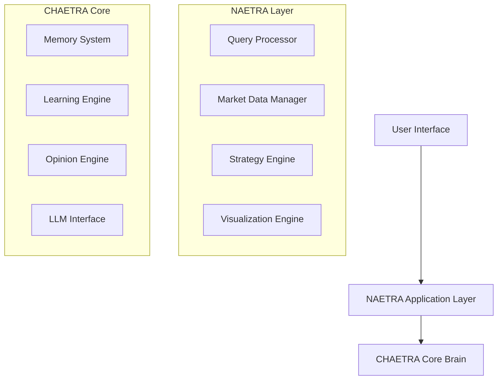
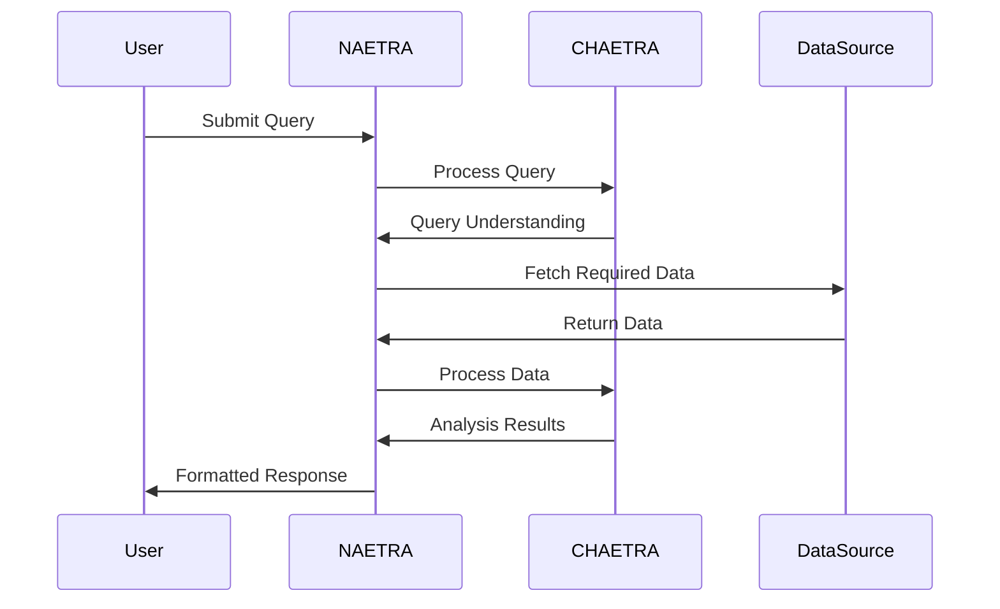
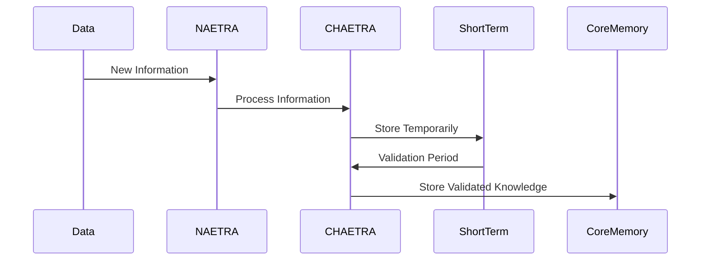
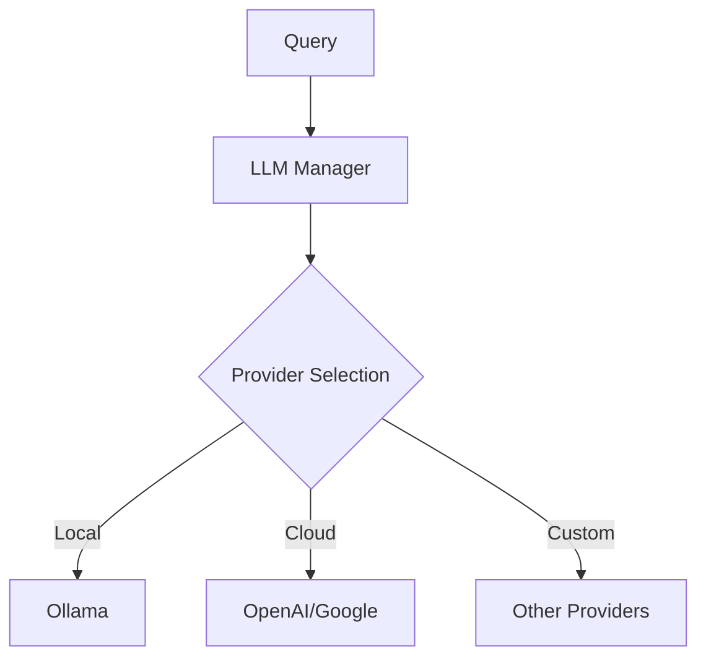
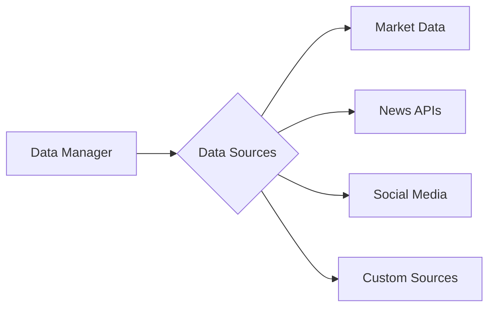
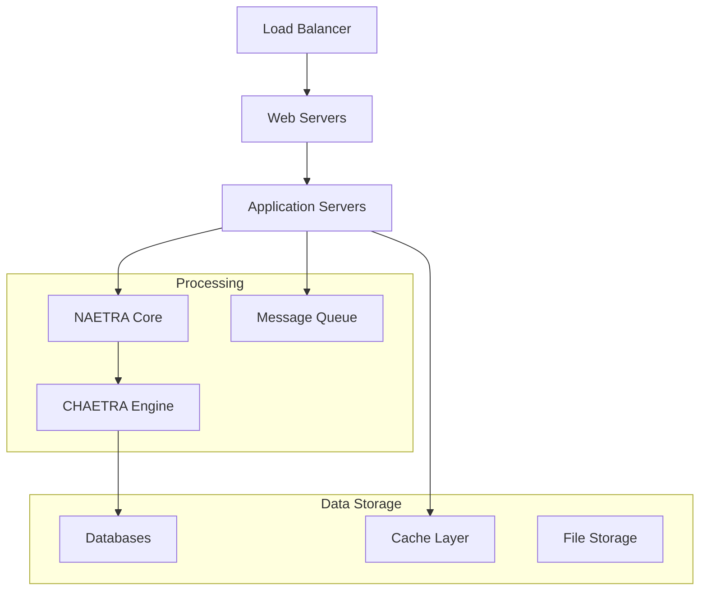

# NAETRA System Architecture

## System Overview



## Design Philosophy

### Core Principles

1. **Modular Architecture**
   - Every component is a pluggable module
   - Clear interfaces between components
   - Easy to swap implementations
   - Independent testing of components

2. **Separation of Concerns**
   - CHAETRA: Core intelligence and learning
   - NAETRA: Domain-specific market analysis
   - Clear boundaries between layers
   - Well-defined communication protocols

3. **Extensibility**
   - Plugin system for new features
   - Support for multiple data sources
   - Configurable LLM providers
   - Custom strategy implementation

4. **Observability**
   - Comprehensive logging
   - System metrics
   - Knowledge inspection
   - Learning progress tracking

## System Components

### 1. CHAETRA Core Brain

The foundation of the system, providing:

- **Memory Management**
  ```mermaid
  graph LR
      A[Incoming Information] --> B[Short-term Memory]
      B --> C{Validation}
      C -->|Success| D[Core Memory]
      C -->|Failure| E[Discard/Review]
  ```

- **Learning System**
  ```mermaid
  graph TD
      A[New Data] --> B[Pattern Recognition]
      B --> C[Validation]
      C --> D[Knowledge Integration]
      D --> E[Opinion Update]
  ```

- **Opinion Formation**
  ```mermaid
  graph LR
      A[Evidence] --> B[Analysis]
      B --> C[Opinion Formation]
      C --> D[Confidence Scoring]
      D --> E[Knowledge Update]
  ```

### 2. NAETRA Application Layer

Specialized market analysis system:

- **Query Processing**
  ```mermaid
  graph TD
      A[User Query] --> B[Natural Language Processing]
      B --> C[Intent Recognition]
      C --> D[Task Generation]
      D --> E[Execution]
  ```

- **Market Analysis**
  ```mermaid
  graph LR
      A[Market Data] --> B[Pre-processing]
      B --> C[Pattern Analysis]
      C --> D[CHAETRA Processing]
      D --> E[Results Formation]
  ```

- **Visualization System**
  ```mermaid
  graph TD
      A[Analysis Results] --> B[Chart Generation]
      B --> C[Interactive Elements]
      C --> D[User Interface]
  ```

## Data Flow

### 1. Query Processing Flow


### 2. Learning Flow


## Integration Points

### 1. LLM Integration


### 2. Data Source Integration


## Configuration System

### 1. Plugin Configuration
```yaml
plugins:
  data_sources:
    - name: yahoo_finance
      enabled: true
      config:
        api_key: "xxx"
    - name: news_api
      enabled: true
      config:
        endpoints:
          - name: financial_news
            url: "http://..."
  
  llm_providers:
    - name: ollama
      enabled: true
      config:
        model: "llama2"
        api_url: "http://localhost:11434"
    
    - name: openai
      enabled: false
      config:
        model: "gpt-4"
        api_key: "xxx"
```

### 2. System Configuration
```yaml
system:
  chaetra:
    memory:
      short_term_ttl: 86400  # 24 hours
      validation_period: 7200 # 2 hours
    
    learning:
      confidence_threshold: 0.85
      minimum_validations: 3
  
  naetra:
    query:
      timeout: 30
      max_retries: 3
    
    visualization:
      default_chart_type: "candlestick"
      max_overlay_charts: 5
```

## Security Considerations

1. **Data Protection**
   - Encryption at rest
   - Secure communication
   - API authentication
   - User data isolation

2. **Access Control**
   - Role-based access
   - API key management
   - Rate limiting
   - Audit logging

## Deployment Architecture



## Performance Optimization

1. **Caching Strategy**
   - Query results
   - Frequently accessed data
   - Computed analytics
   - User preferences

2. **Async Processing**
   - Background tasks
   - Batch processing
   - Event-driven updates
   - Real-time streaming

3. **Resource Management**
   - Connection pooling
   - Memory optimization
   - CPU utilization
   - I/O handling

## Error Handling

1. **Resilience Patterns**
   - Circuit breakers
   - Fallback mechanisms
   - Retry strategies
   - Graceful degradation

2. **Error Recovery**
   - Transaction management
   - State recovery
   - Data consistency
   - System health checks

## Monitoring and Alerts

1. **System Health**
   - Component status
   - Performance metrics
   - Error rates
   - Resource usage

2. **Business Metrics**
   - Query success rates
   - Learning efficiency
   - Opinion accuracy
   - User engagement

## Future Considerations

1. **Scalability**
   - Horizontal scaling
   - Load distribution
   - Data partitioning
   - Service mesh

2. **New Features**
   - Additional data sources
   - Enhanced analytics
   - Mobile support
   - API extensions

3. **Integration**
   - Third-party services
   - Custom plugins
   - External systems
   - API partnerships
