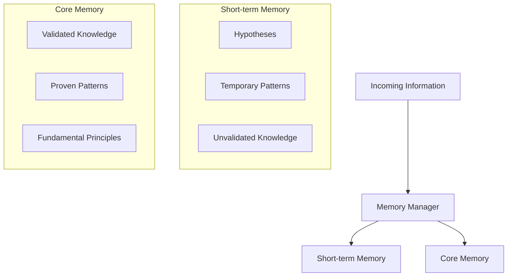
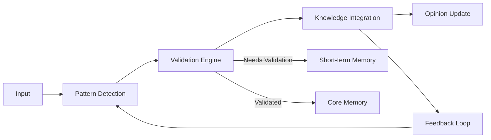
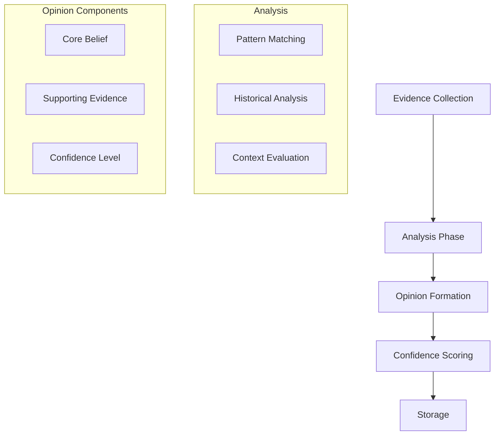
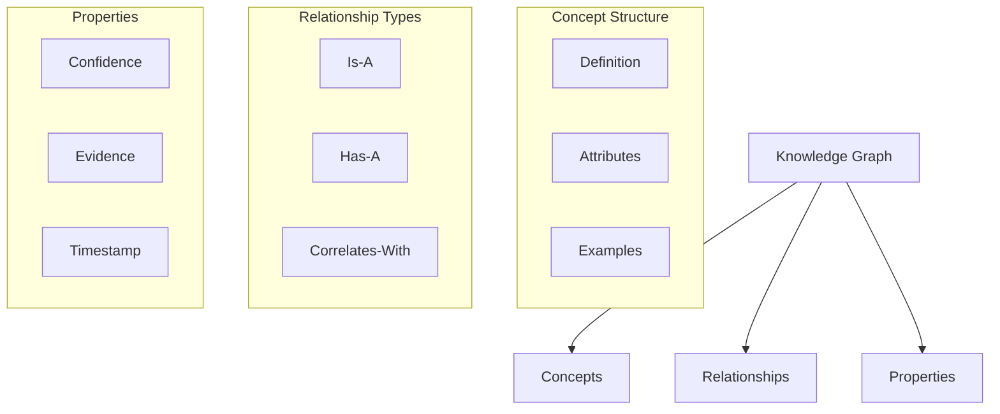
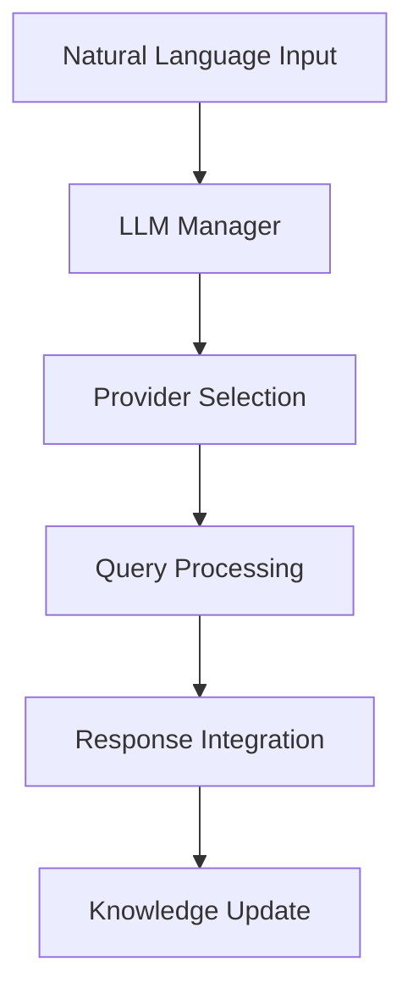
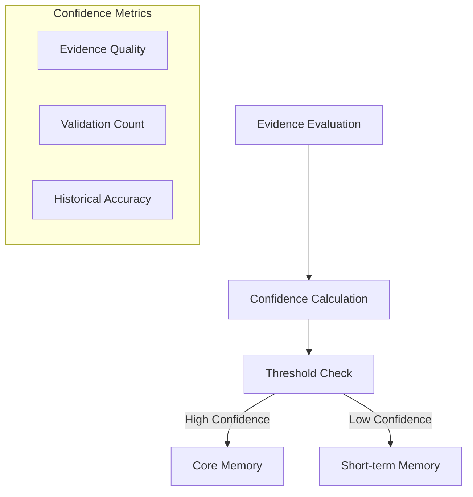
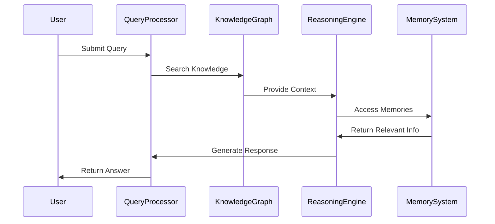

# CHAETRA Engine Documentation

## Overview

CHAETRA (Cognitive Hierarchy of Advanced Evaluation, Thinking & Reasoned Analysis) is a domain-agnostic cognitive engine that forms the core intelligence of the system. While it powers NAETRA's stock market analysis, CHAETRA itself is designed to learn, understand, and form opinions about any domain.

## Core Capabilities

### 1. Dual Memory System


#### Short-term Memory
- **Purpose**: Temporary storage for new information and hypotheses
- **Characteristics**:
  - Time-based expiration
  - Confidence scoring
  - Validation tracking
  - Quick access and update
- **Contents**:
  - New patterns under observation
  - Temporary correlations
  - Unproven hypotheses
  - Recent observations

#### Core Memory
- **Purpose**: Long-term storage for validated knowledge
- **Characteristics**:
  - Permanent storage
  - High confidence knowledge
  - Relationship mapping
  - Evidence tracking
- **Contents**:
  - Proven patterns
  - Validated relationships
  - Fundamental principles
  - Historical evidence

### 2. Learning System



#### Learning Processes

1. **Active Learning**
   - Pattern recognition
   - Relationship discovery
   - Knowledge validation
   - Confidence scoring

2. **Unlearning Process**
   ```mermaid
   graph TD
       A[Contradiction Detection] --> B[Evidence Review]
       B --> C[Confidence Check]
       C -->|Low Confidence| D[Remove Knowledge]
       C -->|Uncertain| E[Mark for Review]
       C -->|High Confidence| F[Keep but Flag]
   ```

3. **Relearning Process**
   ```mermaid
   graph TD
       A[Flagged Knowledge] --> B[New Evidence]
       B --> C[Pattern Validation]
       C --> D[Update Knowledge]
       D --> E[Adjust Confidence]
   ```

### 3. Opinion Formation



#### Opinion Structure
```typescript
interface Opinion {
    topic: string;
    coreBelief: {
        statement: string;
        confidence: number;
        timestamp: DateTime;
    };
    evidence: {
        supporting: Evidence[];
        contradicting: Evidence[];
        weight: number;
    }[];
    context: {
        domain: string;
        relevance: number;
        timeframe: string;
    };
    evolution: {
        history: OpinionState[];
        changes: ChangeRecord[];
        trend: TrendAnalysis;
    };
}
```

### 4. Knowledge Representation



#### Knowledge Types

1. **Factual Knowledge**
   - Verifiable facts
   - Historical data
   - Proven relationships
   - Statistical evidence

2. **Conceptual Knowledge**
   - Abstract concepts
   - Theoretical frameworks
   - Domain principles
   - Mental models

3. **Procedural Knowledge**
   - Process flows
   - Action sequences
   - Decision trees
   - Strategy patterns

### 5. Integration with LLMs



#### LLM Usage Patterns

1. **Natural Language Processing**
   - Query understanding
   - Intent recognition
   - Context extraction
   - Response generation

2. **Knowledge Extraction**
   - Concept identification
   - Relationship extraction
   - Pattern recognition
   - Context understanding

3. **Response Generation**
   - Explanation formulation
   - Analysis articulation
   - Insight communication
   - Query responses

### 6. Learning Modes

1. **Supervised Learning**
   ```mermaid
   graph LR
       A[Labeled Data] --> B[Pattern Recognition]
       B --> C[Validation]
       C --> D[Knowledge Integration]
   ```

2. **Unsupervised Learning**
   ```mermaid
   graph LR
       A[Raw Data] --> B[Pattern Discovery]
       B --> C[Clustering]
       C --> D[Hypothesis Formation]
   ```

3. **Reinforcement Learning**
   ```mermaid
   graph LR
       A[Action] --> B[Feedback]
       B --> C[Adjustment]
       C --> D[Strategy Update]
   ```

### 7. Confidence System



#### Confidence Levels

1. **High Confidence (0.8 - 1.0)**
   - Multiple validations
   - Strong evidence
   - Historical accuracy
   - Consistent results

2. **Medium Confidence (0.5 - 0.79)**
   - Limited validation
   - Mixed evidence
   - Some uncertainty
   - Needs monitoring

3. **Low Confidence (0.0 - 0.49)**
   - Unvalidated
   - Weak evidence
   - High uncertainty
   - Requires validation

### 8. Query Processing



### 9. Error Handling

1. **Knowledge Conflicts**
   - Contradiction detection
   - Resolution strategies
   - Confidence adjustment
   - Evidence review

2. **Learning Failures**
   - Error detection
   - Recovery procedures
   - Fallback mechanisms
   - Learning adjustment

3. **System Recovery**
   - State preservation
   - Knowledge backup
   - Incremental recovery
   - Consistency checks

### 10. Performance Optimization

1. **Memory Management**
   - Efficient storage
   - Quick retrieval
   - Relationship indexing
   - Cache utilization

2. **Processing Optimization**
   - Parallel processing
   - Query optimization
   - Resource management
   - Load balancing

3. **Response Time**
   - Quick access paths
   - Cached responses
   - Priority queuing
   - Resource allocation

## API Interface

### 1. Knowledge Management
```typescript
interface KnowledgeAPI {
    // Knowledge operations
    addKnowledge(knowledge: Knowledge): Promise<void>;
    updateKnowledge(id: string, update: Knowledge): Promise<void>;
    removeKnowledge(id: string): Promise<void>;
    
    // Query operations
    queryKnowledge(query: Query): Promise<Knowledge[]>;
    validateKnowledge(id: string): Promise<ValidationResult>;
    
    // Memory operations
    moveToCore(id: string): Promise<void>;
    moveToShortTerm(id: string): Promise<void>;
}
```

### 2. Learning Management
```typescript
interface LearningAPI {
    // Learning operations
    learn(data: any): Promise<void>;
    unlearn(concept: string): Promise<void>;
    relearn(concept: string, newData: any): Promise<void>;
    
    // Validation operations
    validate(hypothesis: Hypothesis): Promise<ValidationResult>;
    adjustConfidence(id: string, evidence: Evidence): Promise<void>;
}
```

### 3. Opinion Management
```typescript
interface OpinionAPI {
    // Opinion operations
    formOpinion(topic: string): Promise<Opinion>;
    updateOpinion(id: string, newEvidence: Evidence): Promise<void>;
    getOpinion(topic: string): Promise<Opinion>;
    
    // Confidence operations
    getConfidence(id: string): Promise<number>;
    adjustConfidence(id: string, factor: number): Promise<void>;
}
```

## Future Enhancements

1. **Advanced Learning**
   - Deep learning integration
   - Improved pattern recognition
   - Enhanced relationship mapping
   - Better confidence scoring

2. **Optimization**
   - Faster processing
   - Better memory utilization
   - Improved scaling
   - Enhanced performance

3. **New Features**
   - Additional learning modes
   - Enhanced reasoning
   - Better knowledge representation
   - Improved opinion formation

4. **Integration**
   - More LLM providers
   - Enhanced API capabilities
   - Better plugin support
   - Improved extensibility
