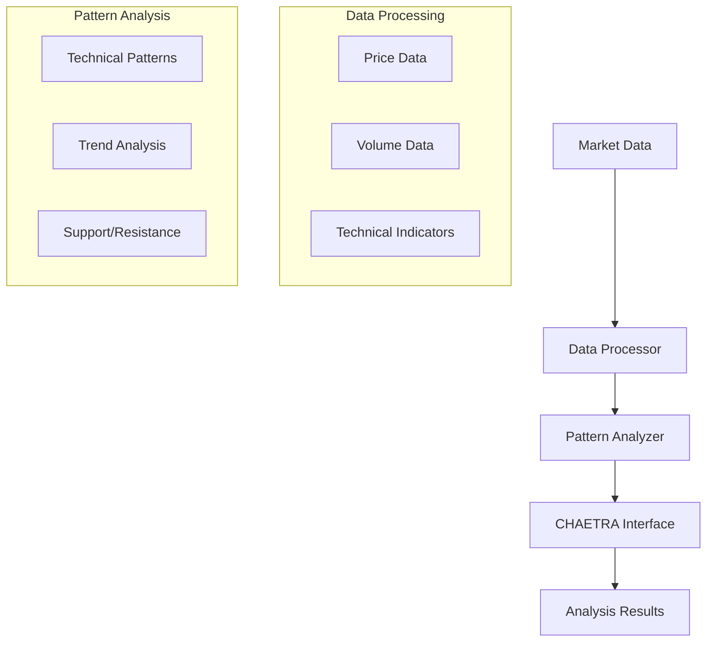
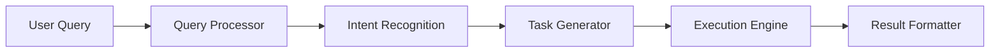
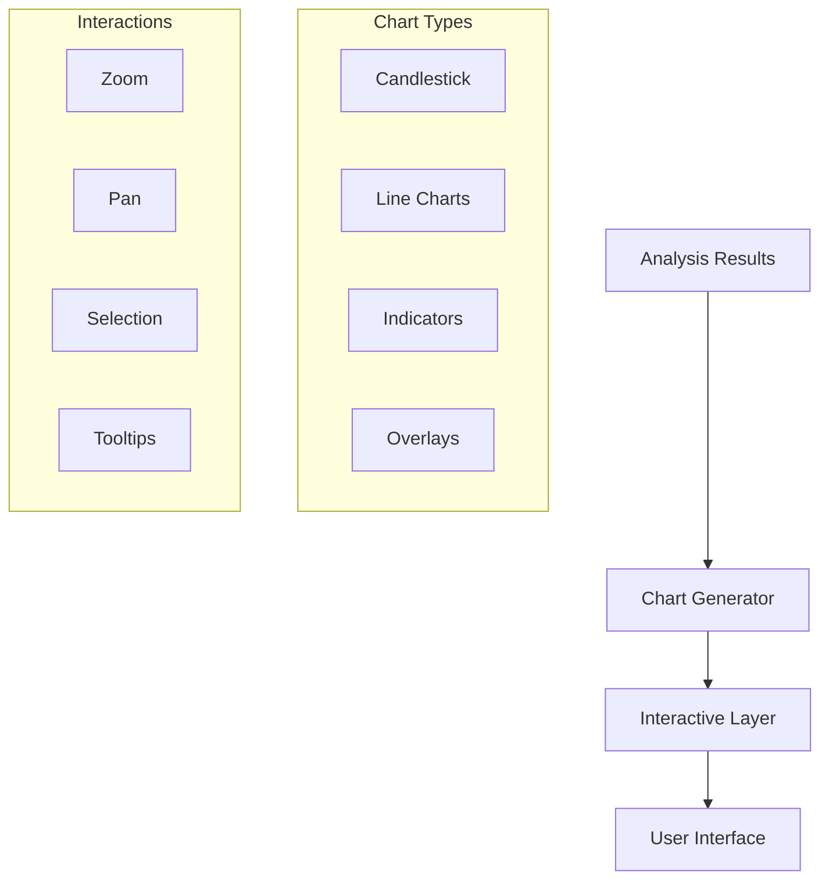
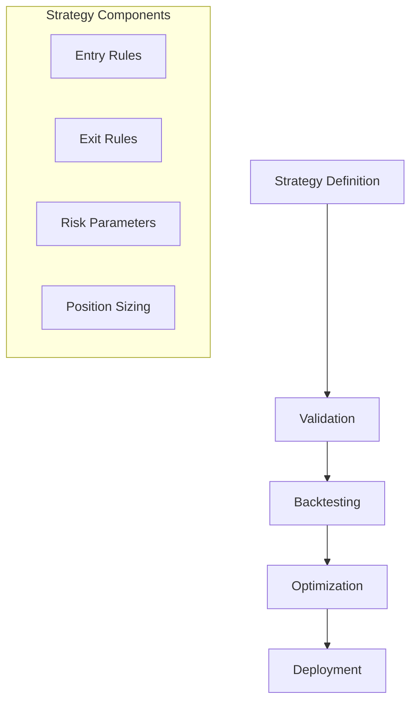
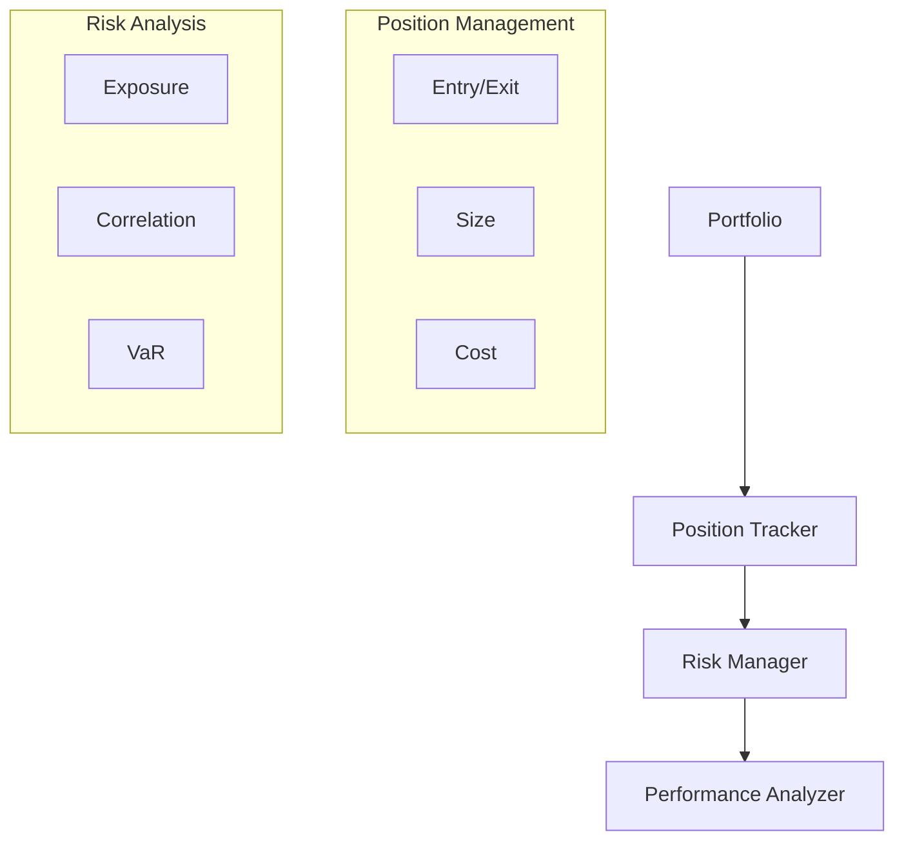
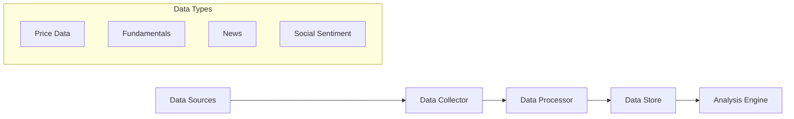
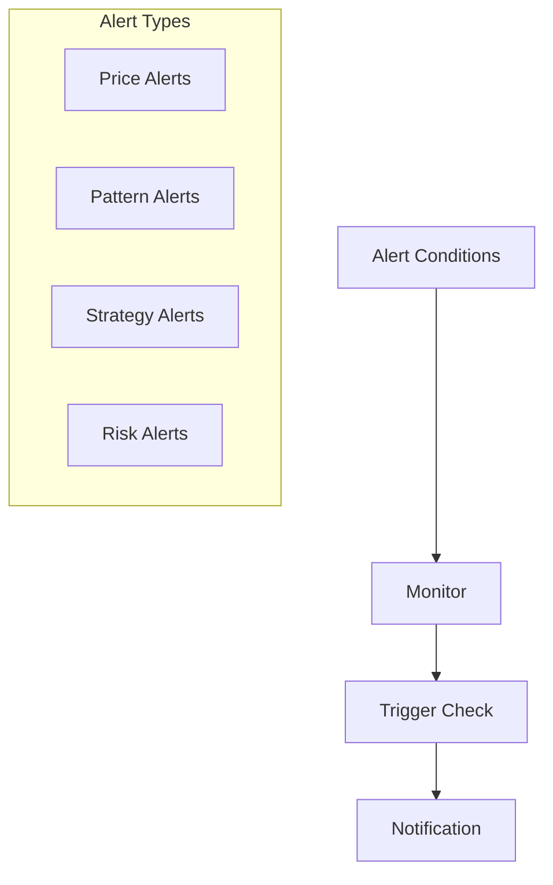
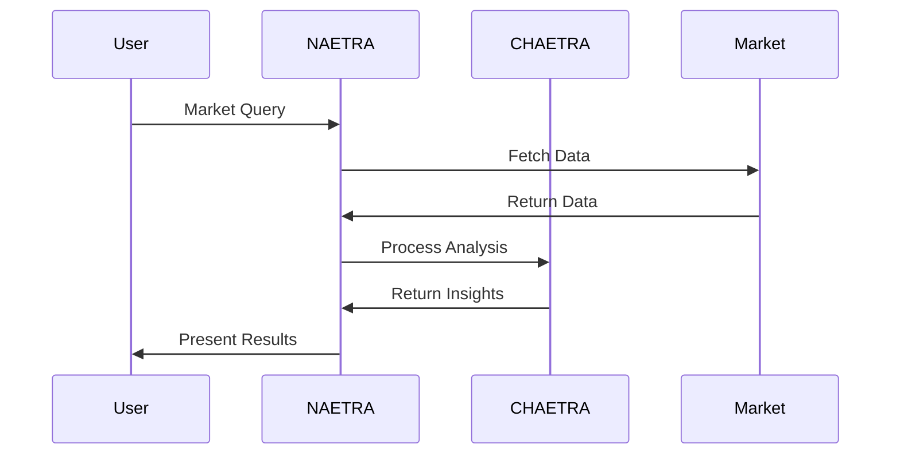
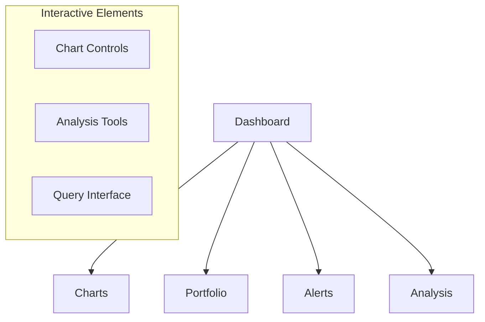

# NAETRA Application Documentation

## Overview

NAETRA (Neural Analysis Engine for Trading Research & Assessment) is a specialized stock market analysis system that leverages CHAETRA's core intelligence for market analysis, pattern recognition, and trading decisions. While CHAETRA provides the fundamental learning and reasoning capabilities, NAETRA adds domain-specific knowledge and tools for stock market analysis.

## Core Components

### 1. Market Analysis System


### 2. Query System


#### Query Types
1. **Market Analysis**
   - Stock price analysis
   - Pattern recognition
   - Trend identification
   - Volume analysis

2. **Portfolio Queries**
   - Position analysis
   - Risk assessment
   - Performance tracking
   - Allocation suggestions

3. **Strategy Queries**
   - Strategy definition
   - Backtest requests
   - Optimization queries
   - Performance analysis

### 3. Visualization Engine



#### Chart Capabilities
1. **Technical Analysis**
   - Price charts
   - Volume analysis
   - Technical indicators
   - Pattern highlighting

2. **Comparative Analysis**
   - Multi-stock overlay
   - Sector comparison
   - Index correlation
   - Performance benchmarking

3. **Custom Visualizations**
   - Strategy performance
   - Portfolio allocation
   - Risk metrics
   - Market sentiment

### 4. Strategy Management



#### Strategy Features
1. **Definition**
   ```typescript
   interface Strategy {
       name: string;
       description: string;
       rules: {
           entry: Rule[];
           exit: Rule[];
           risk: RiskParameters;
       };
       parameters: {
           timeframe: string;
           indicators: Indicator[];
           filters: Filter[];
       };
       performance: {
           backtest: BacktestResults;
           live: LiveResults;
       };
   }
   ```

2. **Backtesting**
   - Historical simulation
   - Performance metrics
   - Risk analysis
   - Optimization suggestions

3. **Monitoring**
   - Real-time tracking
   - Alert generation
   - Performance tracking
   - Risk monitoring

### 5. Portfolio Management



#### Portfolio Features
1. **Position Tracking**
   - Real-time monitoring
   - Cost basis tracking
   - P&L calculation
   - Position sizing

2. **Risk Management**
   - Exposure analysis
   - Correlation tracking
   - Risk metrics
   - Alert generation

### 6. Market Data Integration



#### Data Features
1. **Real-time Data**
   - Price feeds
   - Volume data
   - News streams
   - Social sentiment

2. **Historical Data**
   - OHLCV data
   - Corporate actions
   - Financial statements
   - Market events

### 7. Alert System



#### Alert Features
1. **Condition Types**
   - Price levels
   - Technical patterns
   - Strategy signals
   - Risk thresholds

2. **Notification Methods**
   - In-app alerts
   - Email notifications
   - Mobile push
   - SMS (optional)

### 8. Integration with CHAETRA



#### Integration Points
1. **Data Processing**
   - Market data preparation
   - Pattern identification
   - Context creation
   - Query formatting

2. **Analysis Integration**
   - Pattern validation
   - Trend analysis
   - Opinion formation
   - Strategy validation

### 9. User Interface



#### Interface Features
1. **Dashboard**
   - Market overview
   - Portfolio summary
   - Active alerts
   - Recent analysis

2. **Analysis Tools**
   - Technical analysis
   - Pattern recognition
   - Strategy testing
   - Portfolio analysis

### 10. Configuration System

```yaml
naetra:
  market_data:
    providers:
      - yahoo_finance:
          api_key: "xxx"
          enabled: true
      - alpha_vantage:
          api_key: "xxx"
          enabled: false
  
  analysis:
    technical:
      indicators:
        - type: "MA"
          periods: [20, 50, 200]
        - type: "RSI"
          period: 14
    
    patterns:
      recognition:
        confidence_threshold: 0.8
        minimum_samples: 5
    
  visualization:
    charts:
      default_type: "candlestick"
      timeframes: ["1D", "1W", "1M"]
      indicators: ["MA", "RSI", "MACD"]
    
  alerts:
    check_interval: 60
    notification_methods: ["in_app", "email"]
```

## API Interface

### 1. Market Analysis
```typescript
interface MarketAPI {
    // Analysis operations
    analyzeStock(symbol: string): Promise<Analysis>;
    analyzeSector(sector: string): Promise<SectorAnalysis>;
    compareStocks(symbols: string[]): Promise<Comparison>;
    
    // Pattern operations
    findPatterns(symbol: string): Promise<Pattern[]>;
    validatePattern(pattern: Pattern): Promise<ValidationResult>;
}
```

### 2. Strategy Management
```typescript
interface StrategyAPI {
    // Strategy operations
    createStrategy(strategy: Strategy): Promise<string>;
    updateStrategy(id: string, updates: Partial<Strategy>): Promise<void>;
    backtest(id: string, parameters: BacktestParams): Promise<BacktestResult>;
    
    // Monitoring
    monitorStrategy(id: string): Promise<void>;
    getPerformance(id: string): Promise<Performance>;
}
```

### 3. Portfolio Management
```typescript
interface PortfolioAPI {
    // Position operations
    addPosition(position: Position): Promise<void>;
    updatePosition(id: string, updates: Partial<Position>): Promise<void>;
    closePosition(id: string): Promise<void>;
    
    // Analysis
    analyzePortfolio(): Promise<PortfolioAnalysis>;
    calculateRisk(): Promise<RiskMetrics>;
}
```

## Future Enhancements

1. **Enhanced Analysis**
   - Machine learning models
   - Alternative data sources
   - Advanced pattern recognition
   - Improved predictions

2. **Advanced Features**
   - Options analysis
   - Crypto markets
   - Global markets
   - Advanced derivatives

3. **Platform Extensions**
   - Mobile applications
   - API improvements
   - Integration capabilities
   - Custom plugins

4. **User Experience**
   - Enhanced visualizations
   - Improved interactions
   - Better personalization
   - Advanced tutorials
